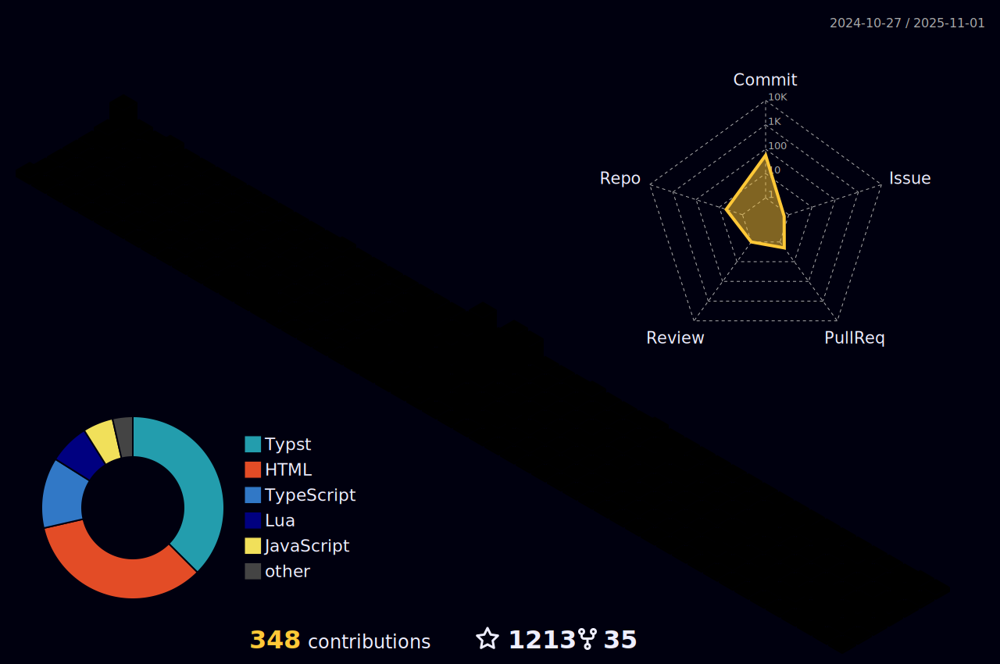

<!-- 

  

    

      
    

    
    
  
  

  

    <a
      href="https://www.linkedin.com/in/drakeaxelrod"
      target="_blank"
      rel="noopener noreferrer"
      style="text-decoration: none; color: black">
        <picture >
          <source srcset="https://github.com/gauravghongde/social-icons/blob/master/PNG/White/LinkedIN_white.png?raw=true" media="(prefers-color-scheme: dark)" type="image/png">
          
        </picture>
    </a>
    <a
      href="https://github.com/DrakeAxelrod"
      target="_blank"
      rel="noopener noreferrer"
      style="text-decoration: none; color: black">
        <picture>
          <source srcset="https://github.com/gauravghongde/social-icons/blob/master/PNG/White/Github_white.png?raw=true" media="(prefers-color-scheme: dark)" type="image/png">
          
        </picture>
    </a>
    <a
      href="https://wa.me/4242099756"
      target="_blank"
      rel="noopener noreferrer"
      style="text-decoration: none; color: black">
        <picture>
          <source srcset="https://github.com/gauravghongde/social-icons/blob/master/PNG/White/WhatsApp_white.png?raw=true" media="(prefers-color-scheme: dark)" type="image/png">
          
        </picture>
    </a>
    <a
      href="https://www.facebook.com/drakeaxelrod"
      target="_blank"
      rel="noopener noreferrer"
      style="text-decoration: none; color: black">
        <picture>
          <source srcset="https://github.com/gauravghongde/social-icons/blob/master/PNG/White/Facebook_white.png?raw=true" media="(prefers-color-scheme: dark)" type="image/png">
          
        </picture>
    </a>
    <a
      href="https://www.instagram.com/drakeaxelrod"
      target="_blank"
      rel="noopener noreferrer"
      style="text-decoration: none; color: black">
        <picture>
          <source srcset="https://github.com/gauravghongde/social-icons/blob/master/PNG/White/Instagram_white.png?raw=true" media="(prefers-color-scheme: dark)" type="image/png">
          
        </picture>
    </a>
    <a
      href="https://x.com/DrakeAxelrod"
      target="_blank"
      rel="noopener noreferrer"
      style="text-decoration: none; color: black">
        <picture>
          <source srcset="https://github.com/gauravghongde/social-icons/blob/master/PNG/White/Twitter_white.png?raw=true" media="(prefers-color-scheme: dark)" type="image/png">
          
        </picture>
    </a>
  

 -->

<!-- Theme
Black             #3f4451
Blue              #4aa5f0
BrightBlack       #4f5666
BrightBlue        #4dc4ff
BrightCyan        #4cd1e0
BrightGreen       #a5e075
BrightMagenta     #de73ff
BrightRed         #ff616e
BrightWhite       #e6e6e6
BrightYellow      #f0a45d
Cyan              #42b3c2
Green             #8cc265
Magenta           #c162de
Red               #e05561
White             #d7dae0
Yellow            #d18f52
background        #23272e
border            #3e4452
foreground        #abb2bf
-->

  

 

## <strong>About me</strong>

My name is Drake and I am cybersecurity professional specializing in offensive security and vulnerability assessment. With a strong foundation in ethical hacking and software engineering, I identify and mitigate security risks across diverse environments, ensuring robust defenses against evolving cyber threats (you can get my resume <a href="https://github.com/drakeaxelrod/resume/raw/refs/heads/main/out/resume.pdf">here</a>).

<!--  -->

## <strong>Github Statistics</strong>

<!-- 
 -->

<!-- 
 -->

<!--  -->

<!-- ## <strong>Experience & Skills</strong>

- Penetration Testing & Ethical Hacking: Assessing and fortifying web applications, APIs, networks, software, embedded systems, and Active Directory.
- Security Research & Development: Award-winning researcher in secure web application development, with a published paper recognized for its contributions to improving software security. Continuously contributing to best security practices.
- Certifications: CPTS (Certified Penetration Testing Specialist), CyberOps Associate (Cisco), CompTIA Network+.
- Cloud & Network Security: Proficient in securing cloud infrastructures, analyzing network protocols, and mitigating attack surfaces.
- Automation & Secure Software: Developing security tools in Rust and PowerShell, streamlining security workflows, and automating penetration testing methodologies. -->

## <strong>Certifications</strong>

## <strong>Tech Stack</strong>
<table>
  <tbody>
    <tr>
      <th style="color: #f0a45d" align="center">Languages</th>
      <th style="color: #4dc4ff" align="center">Tools</th>
      <th style="color: #4cd1e0" align="center">Systems</th>
    </tr>
    <tr>
     <!-- Languages -->
      <td width="33.33%" height="100%" style="text-align: center; align-content: center; align-items: center; justify-content: center;">
        
        
        
        
        
        
        
        
        
        
        
        
        
        
        
        
        
        
        
        
        
        
        
        
      </td>
      <!-- Tools -->
      <td width="33.33%" height="100%" style="text-align: center; align-content: center; align-items: center; justify-content: center;">
        
        
        
        
        
        
        
        
        
        
        
        
        
        
        
        
        
        
        
        
        
      </td>
      <!-- Systems -->
      <td width="33.33%" height="100%" style="text-align: center; align-content: center; align-items: center; justify-content: center;">
        
        
        
        
        
        
        
      </td>
    </tr>
  </tbody>
</table>

<!--  -->

<!-- https://rahuldkjain.github.io/gh-profile-readme-generator/ -->
